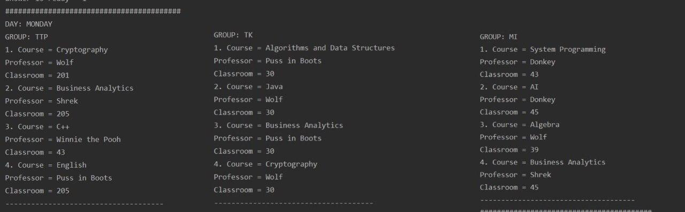
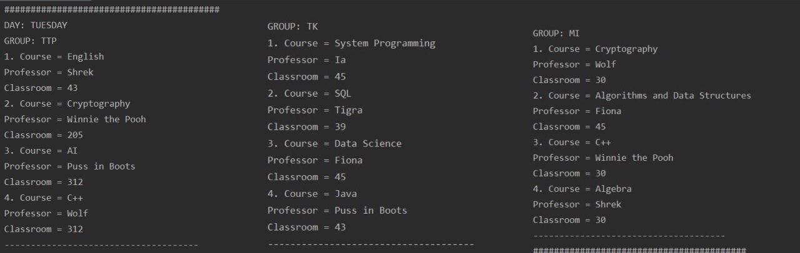
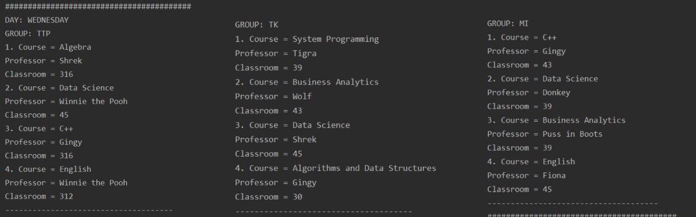
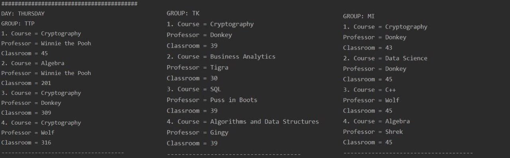
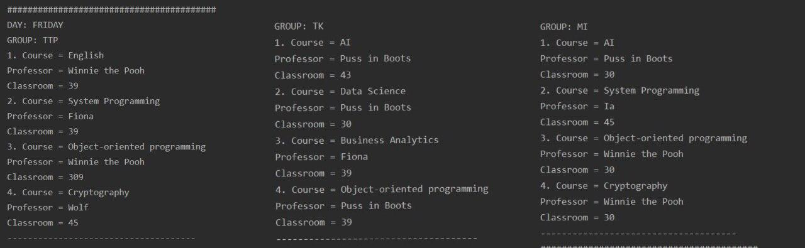

# Schedule_GeneticAlgorithm
Generate schedule with genetic algorithm in C++

# Prerequisites
The project can be built from IDE (ex. CLion) or using cmake file

# Input
The parameters for algorithms are

``````````````
const double mutationRate = 0.02;
const int populationSize = 50;
const int MAX_ITERATIONS = 5000000;
``````````````

The input information should be in the following form.

It includes:
- name of courses
- days of type Day
- name of groups with their sizes and list of courses they need to study
- name of professors with list of courses each can teach
- classroom numbers with their capacity

`````````````
vector<Course> courses = {Course("AI"),
                              Course("SQL"),
                              Course("System Programming"),
                              Course("Data Science"),
                              Course("Business Analytics"),
                              Course("Algebra"),
                              Course("Algorithms and Data Structures"),
                              Course("Object-oriented programming"),
                              Course("C++"),
                              Course("Java"),
                              Course("Cryptography"),
                              Course("English")};

    vector<Day> days = {Day::Monday, Day::Tuesday, Day::Wednesday, Day::Thursday, Day::Friday};
    const int CLASSES_PER_DAY = 4;

    vector<StudentGroup> groups = {StudentGroup("TTP", 56, generateCourses(courses)),
                                   StudentGroup("TK", 25, generateCourses(courses)),
                                   StudentGroup("MI", 29, generateCourses(courses))};

    vector<Professor> professors = {Professor("Tigra", generateCourses(courses)),
                                    Professor("Winnie the Pooh", generateCourses(courses)),
                                    Professor("Ia", generateCourses(courses)),
                                    Professor("Shrek", generateCourses(courses)),
                                    Professor("Donkey", generateCourses(courses)),
                                    Professor("Fiona", generateCourses(courses)),
                                    Professor("Gingy", generateCourses(courses)),
                                    Professor("Puss in Boots", generateCourses(courses)),
                                    Professor("Wolf", generateCourses(courses))};

    vector<Classroom> classrooms = {Classroom(43, 100),
                                    Classroom(39, 100),
                                    Classroom(312, 26),
                                    Classroom(316, 30),
                                    Classroom(201, 27),
                                    Classroom(205, 34),
                                    Classroom(309, 35),
                                    Classroom(45, 58),
                                    Classroom(30, 63)};

`````````````

It is then stored as

```````````````
typedef std::map<ClassTime, std::vector<Class>> SchedulePerClassNumber;
std::map<Day, SchedulePerClassNumber> schedule;
```````````````

# Output
This result was reached on the 637 iteration








